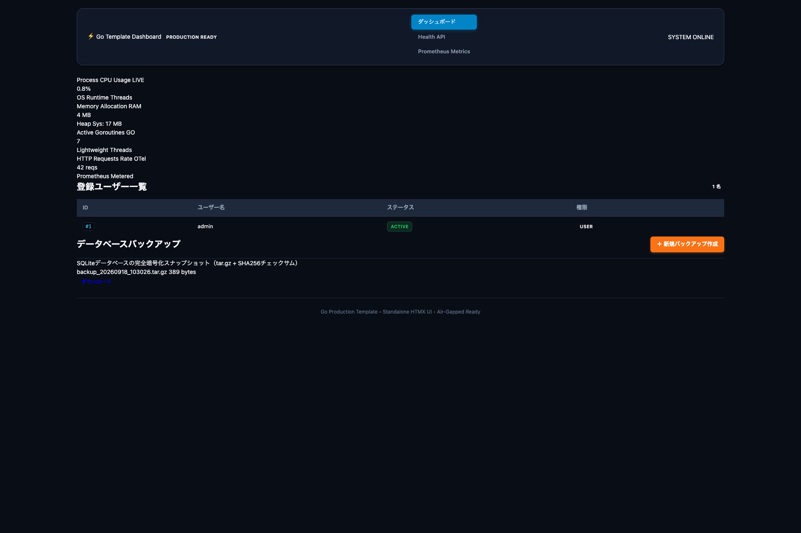

# Go & SRE/DB/Security 開発用 GitHub テンプレートリポジトリ

このリポジトリは、Go (Golang) によるセキュアで高信頼なWebアプリケーション・APIサービス開発を迅速に開始するための、GitHub テンプレートリポジトリです。
CIでの静的解析、脆弱性診断、自動タグ付け (tagpr)、リリース管理 (GoReleaser v2) のパイプラインがあらかじめ統合されているほか、**Node.js不要のスタンドアロン HTMX フロントエンド**、**改変検知付き SQLite バックアップ＆アトミックリストア**、**多層 E2E テストフレームワーク**、および **Claude Code / Antigravity 両対応の AI カスタムスキル**（26種）を標準同梱しています。

---

## 🚀 主な特徴

1. **スタンドアロン HTMX フロントエンド & SSG (Node.js/npm 完全不要)**:
   - `//go:embed` により HTML テンプレートとアセット（HTMX、CSS）を Go バイナリに完全内包（Air-gapped 閉域環境対応）。
   - システムメトリクス（CPU、メモリ、Goroutine数）のリアルタイム自動ポーリング。
   - `make ssg-build` により、GitHub Pages や監査用アーカイブに向けた静的 HTML事前レンダリング出力（SSG）が可能。
2. **SQLite エンタープライズ運用・ガバナンス層**:
   - CGO フリーな SQLite 接続（WAL モード、外部キー制約、ビジータイムアウト自動最適化）。
   - SHA-256 チェックサム付きマニフェストによる改変検知バックアップアーカイブ（`tar.gz`）の作成とアトミックなトランザクション復元。
   - データ保持期間超過レコードの自動パージ（Retention Cleaner）。
3. **多層 E2E テストフレームワーク**:
   - **Layer 1**: 単体＆結合テスト（`make test`、インメモリDB完全分離、カバレッジ 80% 以上）。
   - **Layer 2**: No-Docker スタンドアロン SQLite E2E（`make sqlite-e2e`、認証・CRUD・バックアップ/リストアを 3 秒で高速検証）。
   - **Layer 3**: スタンドアロン フロントエンド E2E（`make frontend-e2e`、Headless Chrome スナップショット撮影と HTML レポート自動生成）。
   - **Layer 4**: Docker フルスタック E2E（`make docker-e2e`、PostgreSQL、VictoriaMetrics、Grafana、API、Web のマルチコンテナ協調動作検証）。
4. **自動リリースパイプライン (tagpr & GoReleaser v2)**:
   - `main` ブランチへの PR マージ時にリリース用 PR が自動作成・更新。
   - リリース PR マージ時に自動でタグが打たれ、GitHub Releases にクロスコンパイルバイナリ（`app`, `web`）が公開。
   - Go バージョンは `go.mod` を単一の信頼できる情報源 (SSOT) として GitHub Actions と完全同期。
5. **AI エージェント用カスタムスキル (Claude & Antigravity 両対応)**:
   - 26種類の専門スキル（`.claude/skills/` および `.agents/skills/`）を同梱。

---

## 📸 スクリーンショット & レポート

| HTMX スタンドアロンダッシュボード | 自動生成された HTML 検証レポート |
| :---: | :---: |
|  | `test_reports/frontend_e2e_report.html` |

---

## 🛠️ クイックスタート

### 1. このリポジトリから新規リポジトリを作成
GitHubの「Use this template」ボタンから、ご自身のリポジトリを作成します。

### 2. モジュール名の変更
作成したリポジトリの `go.mod` 内のモジュール名を変更します。
```go
module github.com/your-username/your-repo-name
```
また、`main.go` や `.goreleaser.yaml` などに含まれるプロジェクト名も必要に応じて書き換えてください。

### 3. ローカル即時起動
Docker 不要で、API サーバーと Web ダッシュボードを即座に起動します：
```bash
make run
```
- Web ダッシュボード: `http://localhost:3001`
- REST API / ヘルスチェック: `http://localhost:8080/v1/system/healthz`

### 4. AI カスタムスキルのインストール
```bash
make install-all
```
*(Claude Code 向けに `~/.claude/skills/` へ、Antigravity 向けに `.agents/skills/` へ配備)*

---

## ⚙️ 開発コマンド一覧

Makefile に定義されている以下のコマンドを使用して開発を進めます：

| コマンド | 説明 |
| :--- | :--- |
| `make run` | スタンドアロンサーバー（Core API + Web UI）のローカル一括起動 |
| `make sqlite-e2e` | Docker 不要の超高速 SQLite E2E テストの実行 |
| `make frontend-e2e` | スタンドアロン HTMX フロントエンド E2E テスト & スナップショット生成 |
| `make docker-e2e` | Docker Compose フルスタック E2E テスト & Grafana 検証 |
| `make ssg-build` | Go テンプレートからの静的サイト事前レンダリング出力 (SSG) |
| `make demo` | フルスタック・インタラクティブデモの起動 |
| `make test` | データ競合検知 (`-race`) およびカバレッジ測定付き単体テスト |
| `make fmt` | ソースコードのフォーマットおよびリンターによる自動修正 |
| `make lint` | `golangci-lint` を使用した静的解析の実行 |
| `make vulncheck` | `govulncheck` を使用した脆弱性診断の実行 |
| `make build` | `bin/app` および `bin/web` へのコンパイル |
| `make release-check` | `GoReleaser v2` 設定ファイルのバリデーション |
| `make release-snapshot` | `GoReleaser` によるローカルでのスナップショットビルドテスト |
| `make license-check` | Go ソースコードのライセンス＆作成者ヘッダーの検証 |
| `make license-add` | ライセンスヘッダーの自動付与 |
| `make check` | 同梱スキルのマークダウン構文チェック |
| `make self-eval` | リポジトリ要件の自己評価の実行 (`REQUIREMENTS.md` の更新) |
| `make clean` | ビルド成果物やテストキャッシュのクリーンアップ |

---

## ☁️ さくらのクラウド Terraform CI/CD

本テンプレートには、さくらのクラウド用の Terraform CI/CD ワークフローが含まれています。`terraform/` ディレクトリ配下のファイルに変更があった場合のみトリガーされます。

### 🔑 GitHub Secrets の設定
以下の GitHub Secrets をリポジトリに登録してください：
- `SAKURA_ACCESS_TOKEN` / `SAKURA_ACCESS_TOKEN_SECRET`
- `AWS_ACCESS_KEY_ID` / `AWS_SECRET_ACCESS_KEY`

---

## 📋 REQUIREMENTS.md による品質自己評価

`make self-eval` コマンドを実行すると、`REQUIREMENTS.md` のチェックボックス（`[x]`）が集計され、適合率（パーセンテージ）が自動計算されてファイル下部に反映されます。
常に適合率 100% を維持する開発プラクティスを推奨します。
