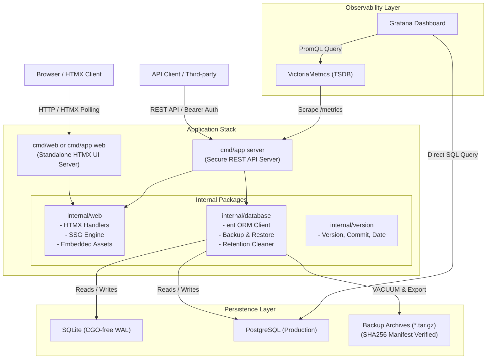
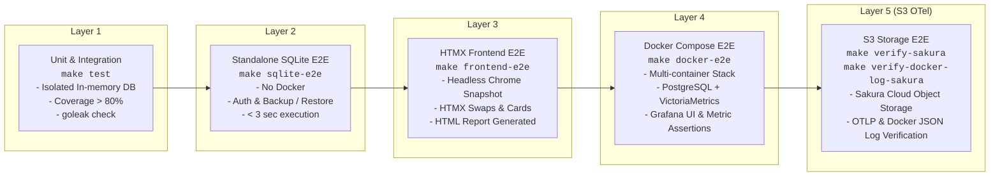

<!--
Copyright 2026 [Copyright Holder]

Licensed under the Apache License, Version 2.0 (the "License");
you may not use this file except in compliance with the License.
You may obtain a copy of the License at

    http://www.apache.org/licenses/LICENSE-2.0

Unless required by applicable law or agreed to in writing, software
distributed under the License is distributed on an "AS IS" BASIS,
WITHOUT WARRANTIES OR CONDITIONS OF ANY KIND, either express or implied.
See the License for the specific language governing permissions and
limitations under the License.

Author: [YOUR_NAME]
-->

# System Architecture & Technical Specifications

本書は、`go_template` のシステム全体アーキテクチャ、コンポーネント構成、データフロー、およびテスト階層について詳述します。

---

## 1. 全体アーキテクチャ概要



---

## 2. コアコンポーネント設計

### 2.1 エントリーポイント構成 (マルチバイナリ & サブコマンド)
- **`cmd/app`**:
  - `server`: コア REST API サーバー起動（TLS、自動証明書、Bearer 認証、バックアップ/リストア API、pprof、Prometheus Exporter）。
  - `web`: スタンドアロン HTMX Web ダッシュボードの起動（または `--ssg-export` による静的サイト出力）。
- **`cmd/web`**:
  - Web ダッシュボード専用の独立したバイナリ。Air-gapped 環境やフロントエンド独立コンテナデプロイに最適。

### 2.2 スタンドアロン HTMX フロントエンド & SSG (`internal/web`)
- **`//go:embed` 組み込み**:
  - `internal/web/static/`: HTMX ライブラリ (`htmx.min.js`)、モダンなダークモード CSS (`dashboard.css`) を内包。
  - `internal/web/templates/`: コンポーネント分割された `html/template` 群。
- **Hypermedia-Driven レンダリング**:
  - システムリソースメトリクス（CPU、メモリ、Goroutine数）の 5 秒周期ポーリング。
  - バックアップ作成ボタン押下時のインプレース部分更新（リアルタイム追加）。
- **SSG (Static Site Generation)**:
  - `ExportStaticSite` により、サーバープロセスを起動せずとも同一テンプレートから静的 HTML とアセットを出力。GitHub Pages への公開やオフライン監査用ダッシュボードとして利用可能。

### 2.3 データベース信頼性・ガバナンス層 (`internal/database`)
- **DSN 自動最適化**:
  - SQLite 接続時に `foreign_keys(1)`, `journal_mode(WAL)`, `busy_timeout(5000)` を自動補正。
  - ファイルベース SQLite の親ディレクトリ未存在時に自動 `os.MkdirAll` を実行し、起動失敗を防止。
- **改変検知バックアップ (`CreateBackupArchive`)**:
  - SQLite の安全なスナップショットを抽出し、テーブル別 JSON とマニフェスト（SHA256 チェックサム、レコード数、タイムスタンプ）を `tar.gz` アーカイブ化。
- **トランザクション復元 (`RestoreBackupArchive`)**:
  - アーカイブ展開後、SHA256 ハッシュを検証。改変・破損が検知された場合は即座にアボート。
  - 単一トランザクション内でテーブルデータを全置換し、失敗時は自動ロールバック。
- **保持期間クリーナー (`PurgeExpiredRecords`)**:
  - 指定保持日数（`retentionDays`）を超過した古いバックアップファイルおよび時系列レコードを自動パージ。

### 2.4 オブザーバビリティスタック (`deploy/`)
- **VictoriaMetrics & Prometheus**:
  - OpenTelemetry メトリクスおよび標準 Go ランタイムメトリクスを 5 秒間隔で収集。
- **Grafana 自動プロビジョニング**:
  - データソース (`deploy/grafana/datasources.yaml`) とダッシュボード (`deploy/grafana/dashboards/overview.json`) をマウントするだけで即時起動。

---

## 3. 多層 E2E テストフレームワーク



---

## 4. OpenTelemetry Collector ログ集約＆S3互換ストレージ転送層

```mermaid
graph TD
    subgraph "Log Producers"
        Service["Go App / Microservices<br/>(otelslog / OTLP gRPC 4317)"]
        DockerEngine["Docker Engine<br/>(/var/lib/docker/containers/*-json.log)"]
        VerifierCLI["sacloud-otel-verifier emit<br/>(OTLP gRPC 4317)"]
    end

    subgraph "sacloud-otel-collector"
        OTLPRecv["otlp receiver<br/>(gRPC :4317 / HTTP :4318)"]
        FilelogRecv["filelog receiver<br/>(Tail Read & JSON Parser)"]
        BatchProc["batch processor<br/>(timeout: 1s-2s)"]
        S3Exp["awss3 exporter<br/>- gzip compression<br/>- s3_force_path_style: true<br/>- partition: logs/%Y/%m/%d/%H/"]
    end

    subgraph "Target Storage"
        SakuraS3["さくらのクラウド オブジェクトストレージ<br/>(isk01 / tky01 Site)"]
        LocalS3["LocalStack S3<br/>(Local Dev)"]
    end

    subgraph "Verification Layer (cmd/verifier)"
        VerifierAssert["sacloud-otel-verifier verify<br/>1. S3 ListObjectsV2 & GetObject<br/>2. gzip Decompression<br/>3. Parse JSON / Extract RunID & TraceID<br/>4. Multi-item Exact Assertion"]
    end

    Service -->|OTLP gRPC| OTLPRecv
    VerifierCLI -->|OTLP gRPC| OTLPRecv
    DockerEngine -->|Tail Read| FilelogRecv

    OTLPRecv --> BatchProc
    FilelogRecv --> BatchProc
    BatchProc --> S3Exp

    S3Exp -->|PUT Object (gzip, JST)| SakuraS3
    S3Exp -.->|PUT Object (Local)| LocalS3

    VerifierAssert -->|Fetch & Verify| SakuraS3
    VerifierAssert -.->|Fetch & Verify| LocalS3
```

### 4.1 パイプライン構成と設定詳細
- **`otlp` receiver**: gRPC (`0.0.0.0:4317`) および HTTP (`0.0.0.0:4318`) でアプリケーションからのログを受信。
- **`filelog` receiver**: Docker コンテナの JSON ログ（`/var/lib/docker/containers/*/*-json.log`）を読み取り、`json_parser` でメッセージ本体を抽出し、コンテナ属性（`container_name`, `image_name` 等）を付与。
- **`awss3` exporter**:
  - `s3_force_path_style: true`: さくらのクラウド オブジェクトストレージ等の S3 互換ストレージにおけるパススタイルアクセス。
  - `compression: gzip`: 帯域およびストレージ容量を最適化。
  - `partition: "logs/%Y/%m/%d/%H"`: 日付・時間単位での階層パーティショニング。

### 4.2 S3 互換ストレージ向け必須フラグ (AWS SDK v2 互換性)
Collector は内部で AWS SDK for Go v2 を利用していますが、最新の AWS SDK v2 はデフォルトで S3 フレキシブルチェックサムヘッダー（`x-amz-checksum-crc32` 等）を要求・検証します。さくらのオブジェクトストレージや MinIO などの S3 互換ストレージではこれらが未サポートのため、`400 InvalidDigest` や `NotImplemented` エラーが発生します。
これを回避するため、以下の環境変数を Collector の実行環境に常時注入しています：
```bash
AWS_RESPONSE_CHECKSUM_VALIDATION=WHEN_REQUIRED
AWS_REQUEST_CHECKSUM_CALCULATION=WHEN_REQUIRED
```

### 4.3 JST (日本時間) タイムゾーン対応
Docker コンテナ環境が UTC の場合、S3 パーティション（`%H`）が UTC 基準となり、日本時間と 9 時間のズレが生じます。
本構成では `deploy/sacloud-otel-collector/Dockerfile` に `tzdata` を導入し、Compose / 環境変数で `TZ=Asia/Tokyo` を指定することで、ストレージ内のパーティションが日本時間通りに作成されます。

### 4.4 検証ツール (`cmd/verifier` & `internal/otels3`) の設計
- **`emitter.go`**: OTel Log SDK (`otelslog`) を用いて、ユニークな `run_id`、TraceID、SpanID、タイムスタンプを付与した構造化ログを Collector へ送出。
- **`verifier.go`**: AWS SDK for Go v2 を用いてオブジェクトストレージから最新のログオブジェクトを取得し、`gzip` 解凍後、OTLP JSON または Docker JSON ログをパースして `run_id` およびトレース情報の完全一致を自動検証。

